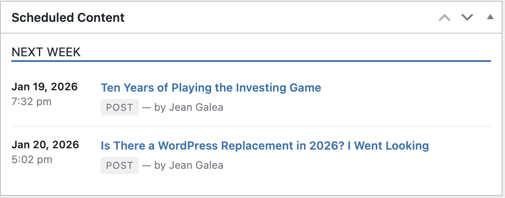

# Scheduled Content Dashboard

A WordPress plugin that adds a dashboard widget listing all scheduled posts, pages, and custom post types, grouped by when they'll be published.



## What it does

- Displays scheduled content on the main WP admin dashboard
- Groups items into Today, Tomorrow, This Week, Next Week, and Later
- Includes any public post type (posts, pages, products, events, etc.)
- Links each title straight to its edit screen

## Install

From WordPress: search for "Scheduled Content Dashboard" under Plugins → Add New.

From this repo:

```bash
git clone https://github.com/jgalea/scheduled-content-dashboard.git
```

Drop the folder into `wp-content/plugins/` and activate.

## Customising the query

Use the `scheduled_content_dashboard_query_args` filter to change what's shown:

```php
add_filter( 'scheduled_content_dashboard_query_args', function ( $args ) {
    $args['posts_per_page'] = 20;
    $args['post_type']      = array( 'post', 'page' );
    return $args;
} );
```

## Requirements

- WordPress 5.0+
- PHP 7.4+

## License

GPL-2.0-or-later
